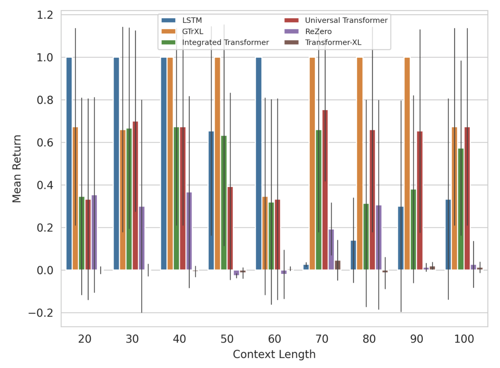

# Transformers for Reinforcement Learning 

This repository formed part of the work: "Evaluating Transformers as Memory Systems in Reinforcement Learning", which investigated several Transformers and compared them to an LSTM baseline. The scaling properties of these models were examined in terms of two specific aspects of memory: length and size. Memory length refers to retaining information over increasing lengths of time, while size is the quantity of information that must be retained. The full report is available in [here](report/evaluating_trf_as_memory_mechanisms_in_rl.pdf). 

## Abstract
> Memory is an important component of effective learning systems and is crucial in non-Markovian as well as partially observable environments. In recent years, Long Short-Term Memory (LSTM) networks have been the dominant mechanism for providing memory in reinforcement learning, however, the success of transformers in natural language processing tasks has highlighted a promising and viable alternative. Memory in reinforcement learning is particularly difficult as rewards are often sparse and distributed over many time steps. Early research into transformers as memory mechanisms for reinforcement learning indicated that the canonical model is not suitable, and that additional gated recurrent units and architectural modifications are necessary to stabilize these models. Several additional improvements to the canonical model have further extended its capabilities, such as increasing the attention span, dynamically selecting the number of per-symbol processing steps and accelerating convergence. It remains unclear, however, whether combining these improvements could provide meaningful performance gains overall. This dissertation examines several extensions to the canonical Transformer as memory mechanisms in reinforcement learning and empirically studies their combination, which we term the Integrated Transformer. Our findings support prior work that suggests gating variants of the Transformer architecture may outperform LSTMs as memory networks in reinforcement learning. However, our results indicate that while gated variants of the Transformer architecture may be able to model dependencies over a longer temporal horizon, these models do not necessarily outperform LSTMs when tasked with retaining increasing quantities of information.

# How to Run Experiments 
## Docker 

Build the Docker file: 
```console
foo@bar:~$ make build
```

Run the Docker image:

Without GPU:  
```console
foo@bar:~$ make up
```
With GPU: 
```console
foo@bar:~$ make up USE_GPU=True
```

## Running Experiments
Specify the experiment you would like to run by editing the `run_experiments.sh` file. Then run the experiment using the following make command:
```console
foo@bar:~$ make run
```

## Specifying Transformer, Environment and Agent Configurations 

The configuration for each experiment can be specified by writing/editing the configuration file (e.g. configs/experiment.yaml) or with flags in the command line interface. The configuration files are managed with [Hydra](https://hydra.cc/docs/intro/), and the following options are available: 
- Memory Models: 
    - Transformer ([Attention is All you Need](https://arxiv.org/abs/1706.03762))
    - Transformer-XL ([Transformer-XL: Attentive Language Models Beyond a Fixed-Length Context](https://arxiv.org/abs/1901.02860))
    - Gated Transformer-XL ([Stabilizing Transformers for Reinforcement Learning](https://arxiv.org/abs/1910.06764))
    - ReZero ([ReZero is All You Need: Fast Convergence at Large Depth](https://arxiv.org/abs/2003.04887))
    - Universal Transformer ([Universal Transformers](https://arxiv.org/abs/1807.03819))
    - LSTM 
    - GRU 
- Environments ([Behaviour Suite for Reinforcement Learning](https://arxiv.org/abs/1908.03568)): 
    - Memory Length
    - Memory Size 
    - Distributed Memory 

The hyperparameters for the model for each experiment can also be specified by adding them to the command line. For example: 
```
python experiment.py env.name="memory_size" memory="gtrxl" memory.num_layers=10 experiment_info.device="cuda"
``` 

# Results and Analysis 


## Scaling with Memory Length 

The Gated Transformer-XL, LSTM and the Integrated Transformer were the top three performing models on these experiments, followed by the Universal Transformer, ReZero and finally the Transformer-XL. 



## Scaling with Memory Size 

The Gated Transformer-XL, LSTM and the Integrated Transformer were the top three performing models on the memory size experiments. The Universal Transformer, ReZero and the Transformer-XL performed very poorly. 


